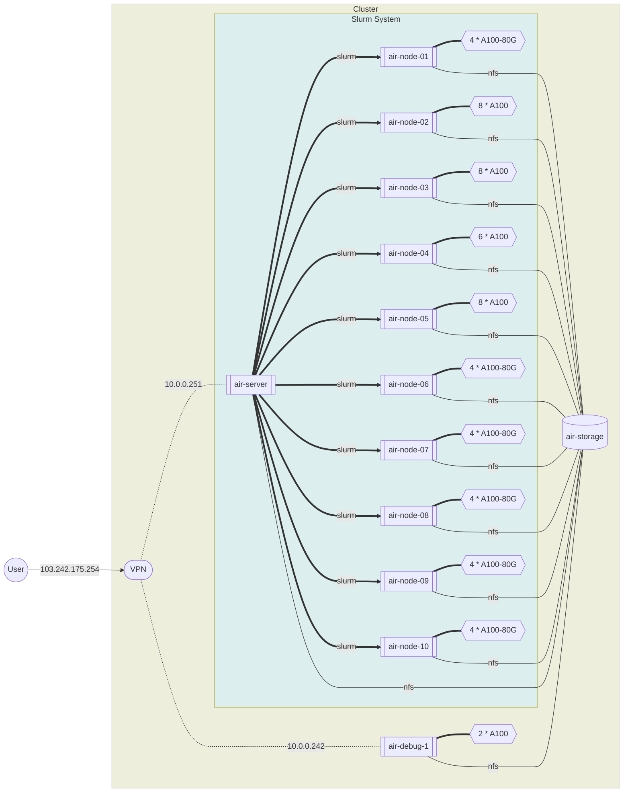

```mermaid
graph LR;
classDef className fill:#f9f,stroke:#333,stroke-width:4px;
	subgraph sA[Cluster];
        A[[air-server]];
        
        B1[[air-node-01]];
        B1_desc{{4 * A100-80G}};
        
        B[[air-node-02]];
        B_desc{{8 * A100}};
        
        C[[air-node-03]];
        C_desc{{8 * A100}};
        
        D[[air-node-04]];
        D_desc{{6 * A100}};
        
        D1[[air-node-05]];
        D1_desc{{8 * A100}};
        
        D2[[air-node-06]];
        D2_desc{{4 * A100-80G}};
        
        D3[[air-node-07]];
        D3_desc{{4 * A100-80G}};
        
        D4[[air-node-08]];
        D4_desc{{4 * A100-80G}};
        
        D5[[air-node-09]];
        D5_desc{{4 * A100-80G}};
        
        D6[[air-node-10]];
        D6_desc{{4 * A100-80G}};
        
        
        E[(air-storage)];
        Z[[air-debug-1]];
        
        G{{2 * A100}};
        

        subgraph sB[Slurm System]
	        A===>|slurm|B1;
            A===>|slurm|B;
            A==>|slurm|C;
            A==>|slurm|D;
            A==>|slurm|D1;
            A==>|slurm|D2;
            A==>|slurm|D3;
            A==>|slurm|D4;
            A==>|slurm|D5;
            A==>|slurm|D6;

			B1===B1_desc
            B===B_desc;
            C===C_desc;
            D===D_desc;
            D1===D1_desc;
            D2===D2_desc;
            D3===D3_desc;
            D4===D4_desc;
            D5===D5_desc;
            D6===D6_desc;

        end
        
        B1----|nfs|E;
        A----|nfs|E;
        B----|nfs|E;
        C----|nfs|E;
        D----|nfs|E;
        D1----|nfs|E;
        D2----|nfs|E;
        D3----|nfs|E;
        D4----|nfs|E;
        D5----|nfs|E;
        D6----|nfs|E;


    F([VPN]);
    Z===G;
    Z----|nfs|E;
    F-.-|10.0.0.251|A;
    F-.-|10.0.0.242|Z;
	end
	T((User));
	T-->|103.242.175.254|F;
    style sA fill:#EED,stroke:#DDD;
    style sB fill:#DEE;
```

