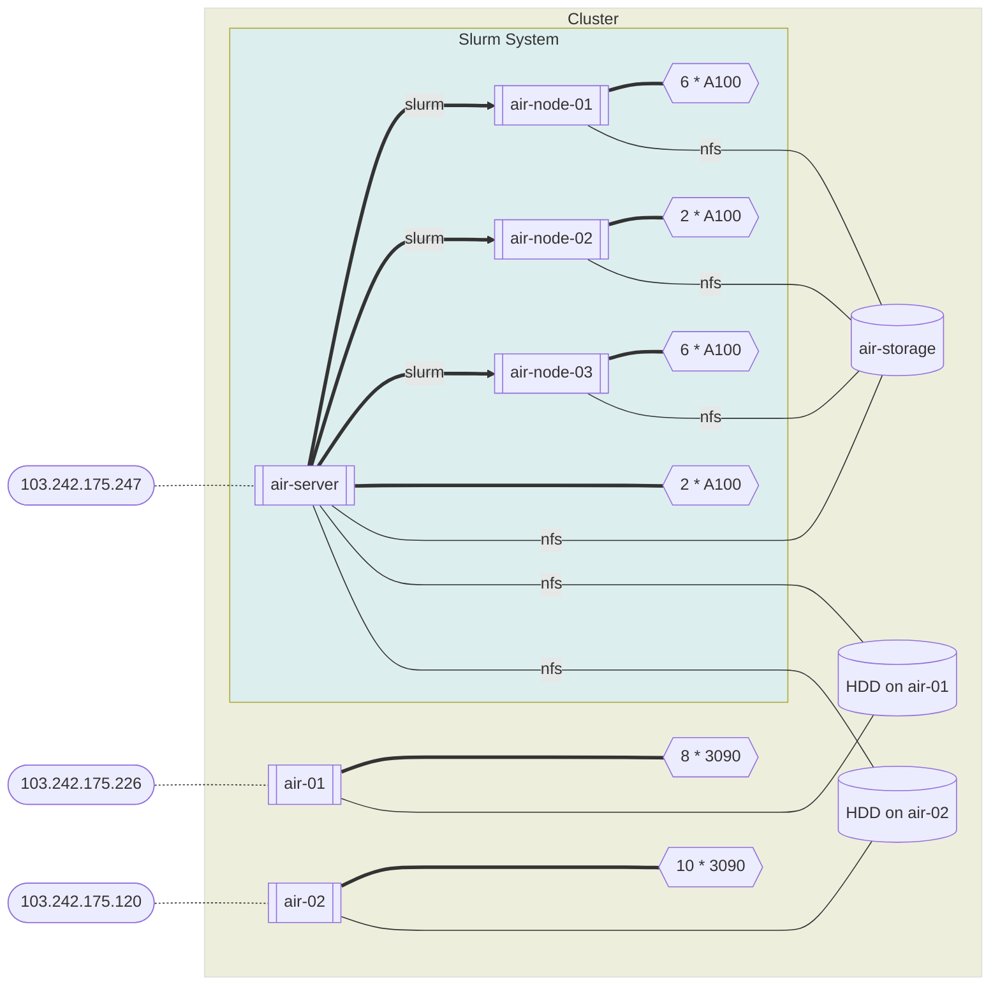

```mermaid
graph LR;
classDef className fill:#f9f,stroke:#333,stroke-width:4px;
	subgraph sA[Cluster];
        A[[air-server]];
        B[[air-node-01]];
        C[[air-node-02]];
        D[[air-node-03]];
        E[(air-storage)];
        G{{2 * A100}};
        H{{6 * A100}};
        I{{2 * A100}};
        J{{6 * A100}};

        subgraph sB[Slurm System]
            A===>|slurm|B;
            A==>|slurm|C;
            A==>|slurm|D;
            A=====G;
            B===H;
            C===I;
            D===J;
        end
        A----|nfs|E;
        B----|nfs|E;
        C----|nfs|E;
        D----|nfs|E;
        K2[[air-01]];
        K3[[air-02]];
        K4{{8 * 3090}};
        K5{{10 * 3090}};
        K6[(HDD on air-01)];
        K7[(HDD on air-02)];
        K2=====K4;
        K2------K6;

        K3=====K5;
        K3------K7;
        A------|nfs|K6;
        A------|nfs|K7;
    end
    F([103.242.175.247]);
    K0([103.242.175.226]);
    K1([103.242.175.120]);
    K1-.-K3;
    K0-.-K2;
    F-.-A;
    style sA fill:#EED,stroke:#DDD;
    style sB fill:#DEE;
```