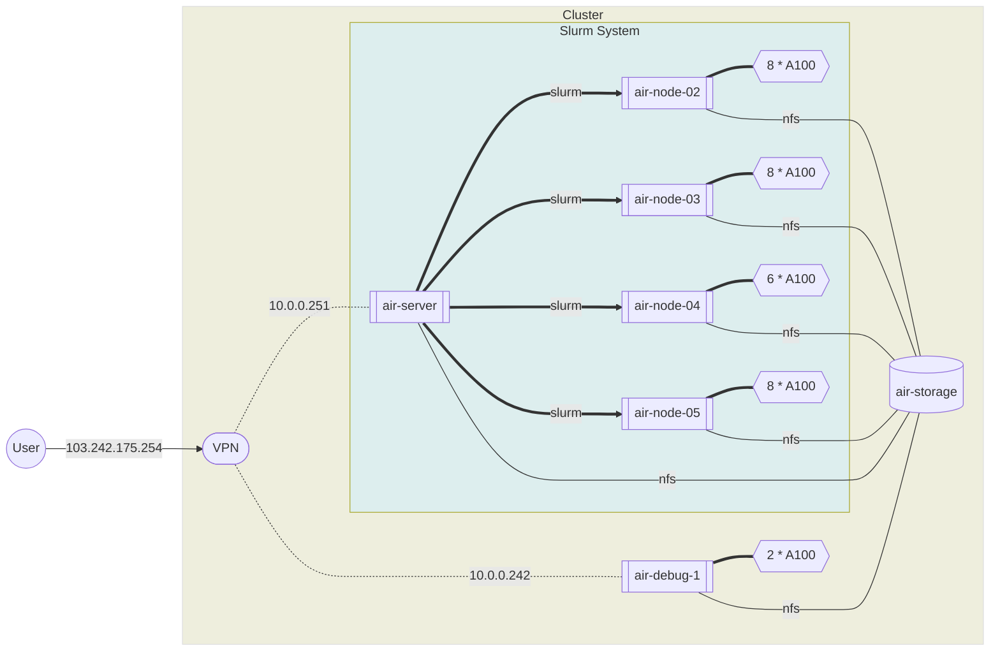

```mermaid
graph LR;
classDef className fill:#f9f,stroke:#333,stroke-width:4px;
	subgraph sA[Cluster];
        A[[air-server]];
        B[[air-node-02]];
        C[[air-node-03]];
        D[[air-node-04]];
        D1[[air-node-05]];
        E[(air-storage)];
        Z[[air-debug-1]];
        G{{2 * A100}};
        H{{8 * A100}};
        I{{8 * A100}};
        J{{6 * A100}};
        J1{{8 * A100}};

        subgraph sB[Slurm System]
            A===>|slurm|B;
            A==>|slurm|C;
            A==>|slurm|D;
            A==>|slurm|D1;

            B===H;
            C===I;
            D===J;
            D1===J1;
        end
        A----|nfs|E;
        B----|nfs|E;
        C----|nfs|E;
        D----|nfs|E;
        D1----|nfs|E;


    F([VPN]);
    Z===G;
    Z----|nfs|E;
    F-.-|10.0.0.251|A;
    F-.-|10.0.0.242|Z;
	end
	T((User));
	T-->|103.242.175.254|F;
    style sA fill:#EED,stroke:#DDD;
    style sB fill:#DEE;
```

