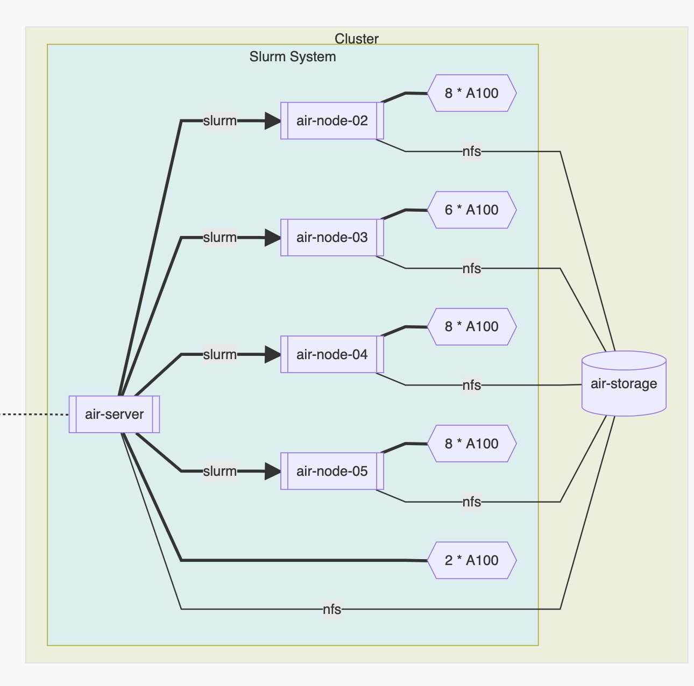

# 概述

## 使用前必读

!!! danger "请认真阅读本指南"
    这是一份 AIR 计算资源的使用指南，其中包括了若干注意事项和命令帮助。
    为了服务器的稳定运行以及使用者的数据安全，请各位用户认真阅读。
    如果发现本指南中的疏漏之处，请联系管理员，或点击右上角链接进入 GitHub 提交 issue 或 pull request 。

!!! danger "不要着急使用"
    请阅读 [注意事项](https://co1lin.github.io/AIR-Server-Doc/basis/) 。

## Updates

2021.12.04 更新：

* 支持任务开始运行、结束运行时，通过邮件通知用户，如需使用请参考[这里](https://co1lin.github.io/AIR-Server-Doc/gpu/#2-srun)

2021.11.30 更新：

* 所有节点均已添加容器应用支持
* 添加资源使用限制：单个用户占用GPU数量最多为**8张**

2021.11.27 更新：

* 任务运行时间上限调整为**3天**，用户运行任务上限为**4个**（队列中任务数量无限制）。如有特殊需求请联系管理员
* 已在 `air-node-01` 与 `air-node-03` 上添加容器运行支持，如需使用请参考[这里](https://co1lin.github.io/AIR-Server-Doc/enroot/)

## 服务器架构

