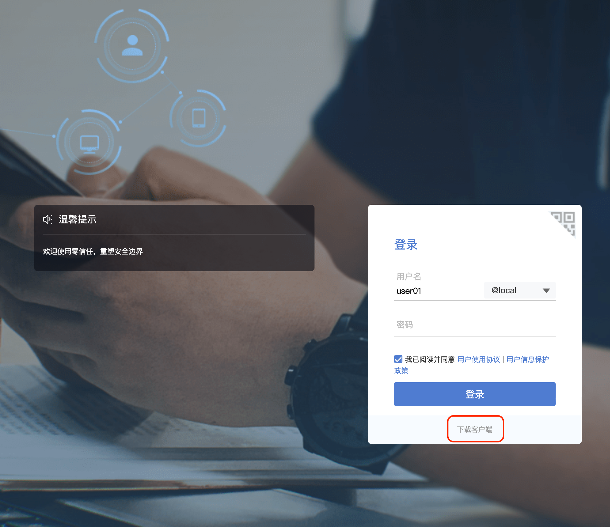

# VPN 

!!! danger "春节之后只能通过 VPN 访问集群"
    2022年2月7日之后，集群资源将只能通过 VPN 访问
    

## VPN 使用方法

1. 打开浏览器输入 [https://103.242.175.254](https://103.242.175.254)，点击下载

   

2. 安装 aTrust 客户端
3. 安装完成后进入网页端输入用户名、密码登陆

## VPN 内网资源

1. `10.0.0.251` : Slurm 集群跳板机
2. `10.0.0.3` : 原 8 * 3090 集群
3. `10.0.0.1 `: 原 10 * 3090 集群

连接 VPN 后，可正常通过 ssh 等工具访问资源
